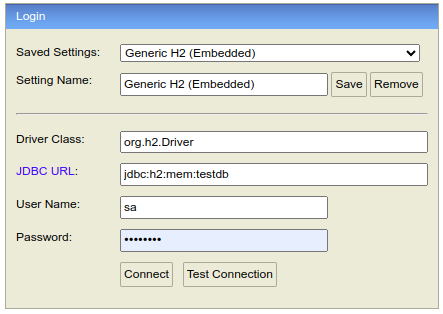

# gestionempleados-backend

Prueba de  Gestion de Empleados nivel 3

* **Para acceder a la base de datos se debe ejecutar el proyecto y acceder a la URL http://localhost:8080/h2-console**

**userName**: sa

**Password**: password

* **Para consumir los servicos rest, en la paquete  src/main/resources/postmancollection se encuenra una collection de Postman con cada uno de los clientes.**
